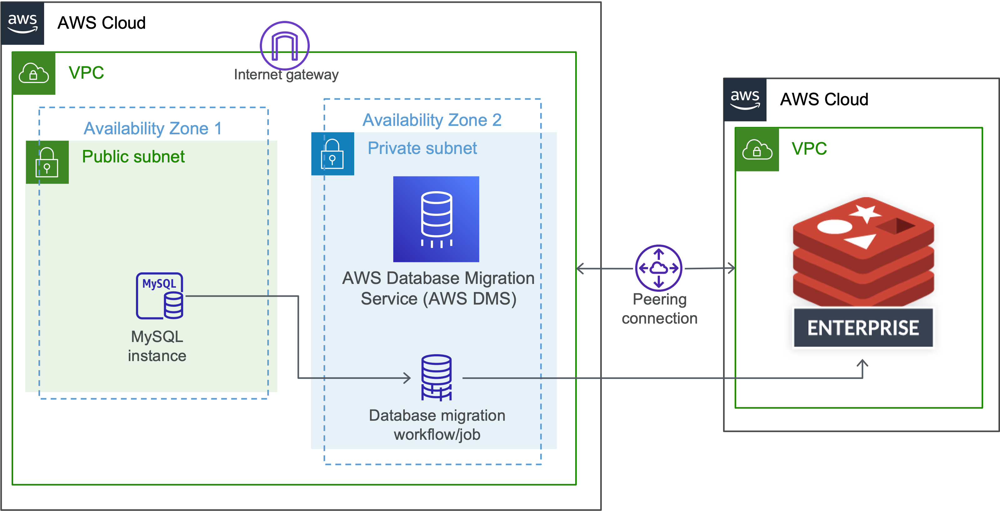

# Lab 1 - Migration Architecture Review and VPC Setup

## Objectives

In this hands on lab exercise, you will
* Review the data migration services architecture that you are going to build from ground up in the rest of the exercises in this guide
* Setup AWS VPC (Virtual Private Cloud) to deploy the cloud resources that you are going to use for the rest of the exercises in this guide.

## Data Migration architecture

Here is the Data Migration Architecture that you are going to build from ground up in this exercise guide, when you finish all of the exercises.

### Pre-requisites
* Access to an AWS Cloud account where you can provision cloud resources
* Access to Redis Enterprise Cloud Free Tier OR Flexible Subscription
