# Lab 1 - Migration Architecture Review and VPC Setup

## Objectives

In this hands on lab exercise, you will
* Review the data migration services architecture that you are going to build from ground up in the rest of the exercises in this guide
* Setup AWS VPC (Virtual Private Cloud) to deploy the cloud resources that you are going to use for the rest of the exercises in this guide.

## Data Migration architecture

Here is the Data Migration Architecture that you are going to build from ground up in this exercise guide, when you finish all of the exercises.


### Pre-requisites
* Access to an AWS Cloud account where you can provision cloud resources
* Access to Redis Enterprise Cloud Free Tier OR Flexible Subscription

## Data Migration Architecture - Source System Review
Here is your source system Cloud Infrastructure.
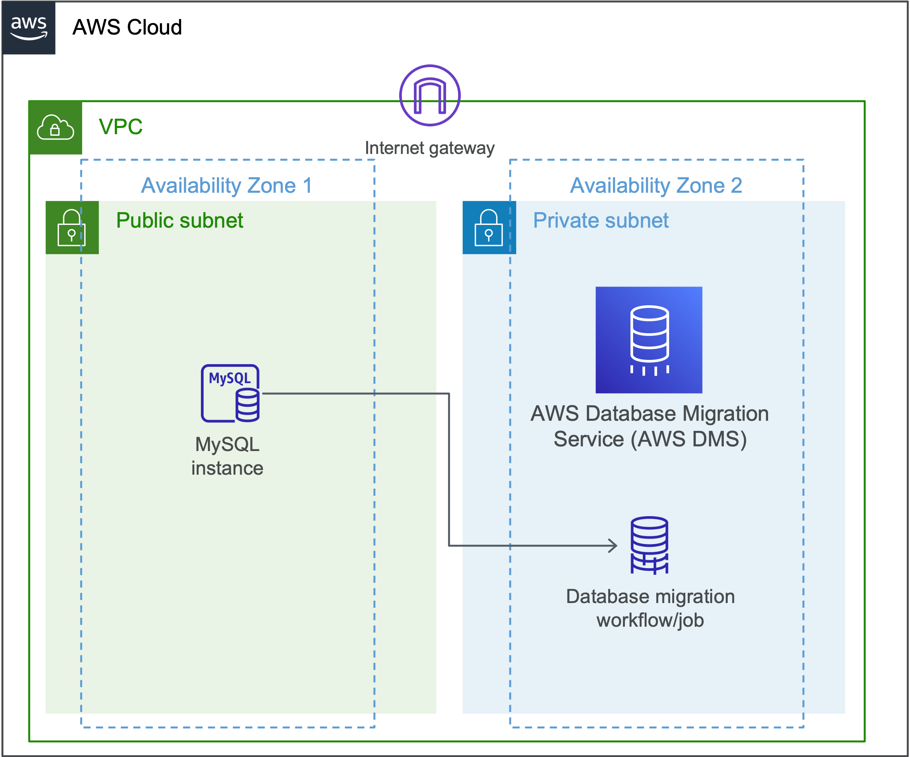

### MySQL (Source database system for Migration)
This is your source system.
Notice that its running in a public subnet.
This is done only to minimize configurations to access this instance from your local laptop from home or anywhere else.

In real world, your source system would be running from your on-prem corporate data center of your company.  So, even though  you are provisioning this MySQL in AWS on a public subnet, pretend that this would actually represents an on-prem source database in your data-center.  Again, only for the exercises sake, its deployed in AWS.

### AWS Database Migration Service (AWS DMS)
We will use AWS DMS for the actual migration by defining a Database migration job.
Notice that this is running in the same VPC but on a different subnet (private subnet) in AWS.


## Creating a VPC:
So, let get started by creating a VPC.
1. Give it a name. ( ex: devday-demo-vpc)
2. Choose IPv4 CIDR manual input
3. Give CIDR as : 10.0.0.0/16
4. Give meaningful tags info.

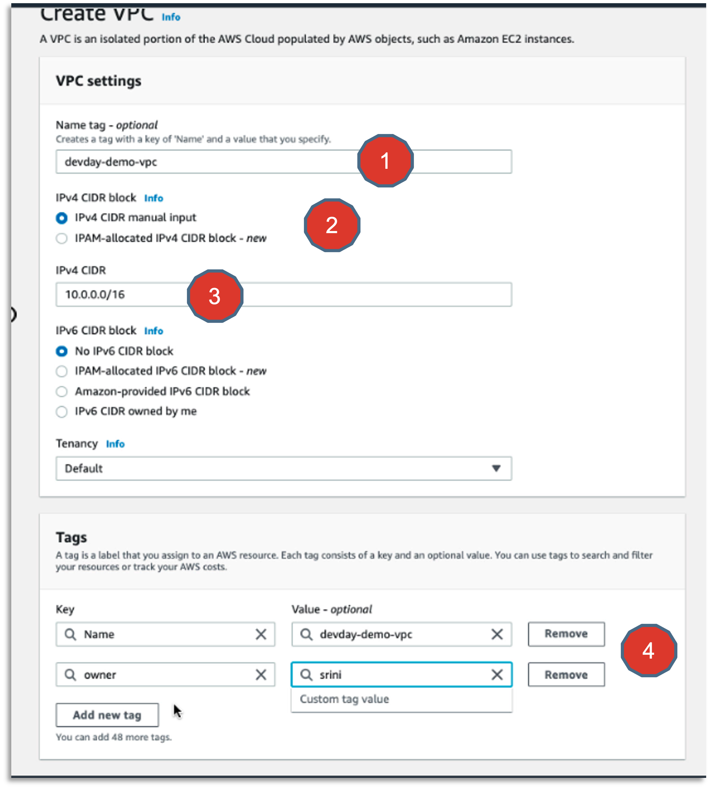

## Creating Subnets:
Go ahead and create two subnets for the VPC you created in the previous step.
In AWS Console, go to VPC ==> Subnets ==> Create Subnet.
Define VPC ID.
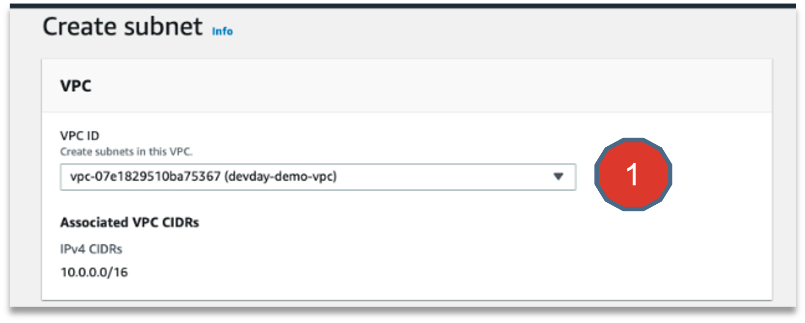

Define the following configurations for each subnets.

```
Subnet 1:
Name: devday-demo-subnet1
Availability Zone: us-west-2a
CIDR: 10.0.1.0/24
```

```
Subnet 2:
Name: devday-demo-subnet2
Availability Zone: us-west-2b
CIDR: 10.0.2.0/24
```
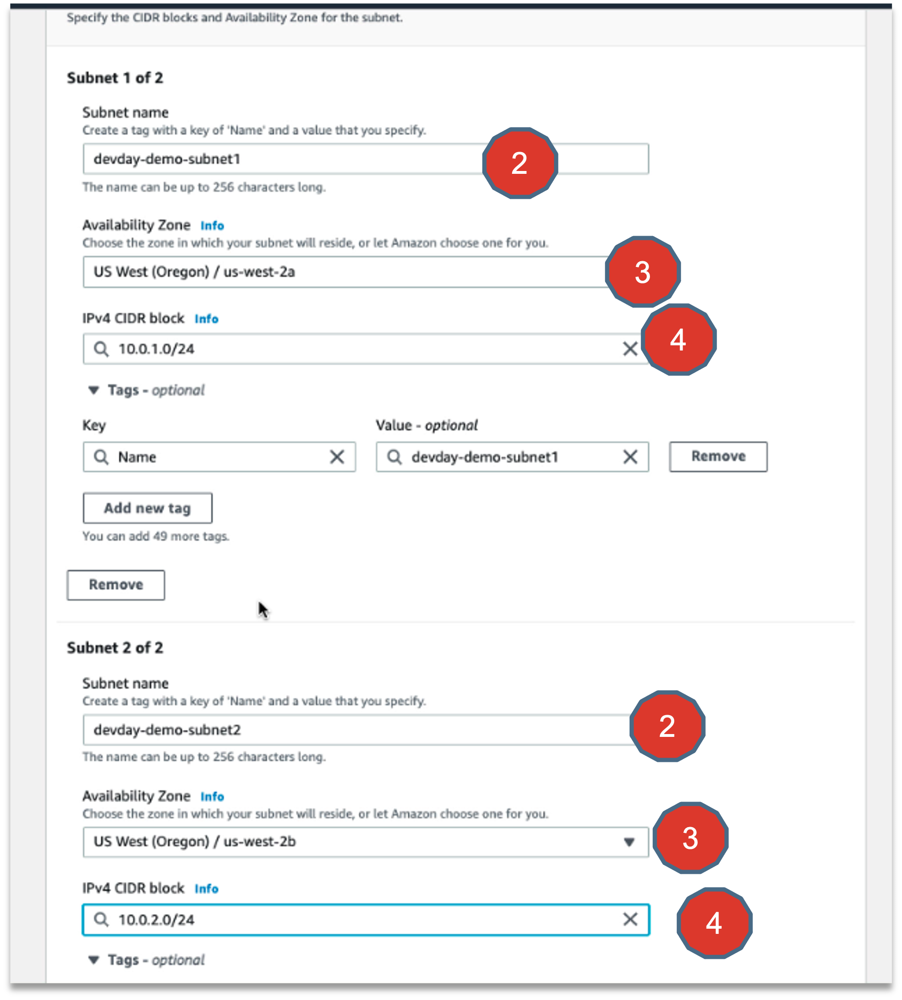


## Giving meaningful tags
Going forward always give meaningful Tags for all of your Cloud Resources.
It’s a good practice to do so. This will not be mentioned going forward.

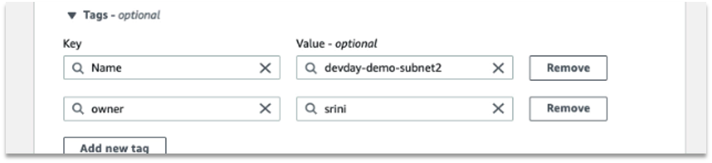

## Review Subnets
Once you have successfully created the subnets, they appear in your list as shown below, if you search for subnet using a string like :  “devday-demo-subnet”

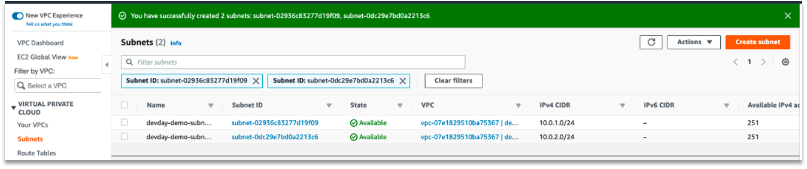

## Internet Gateway Setup
Create an internet gateway ( Point#1 )

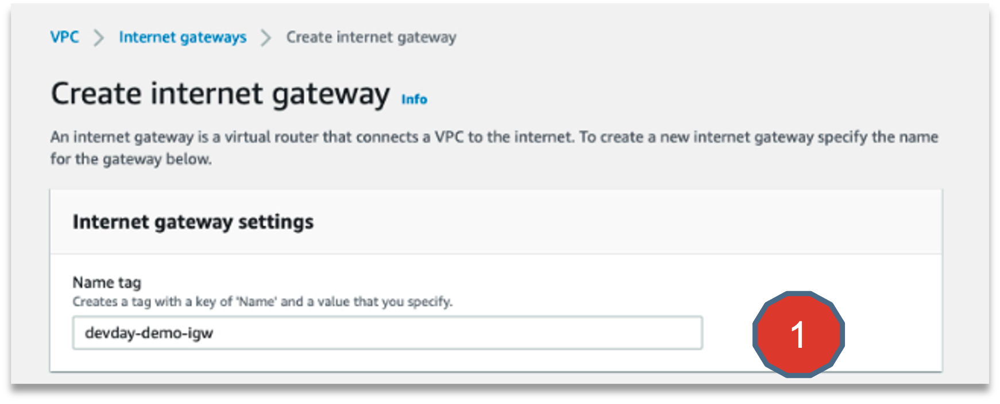

And attach it to the VPC ( Point #2 and #3)
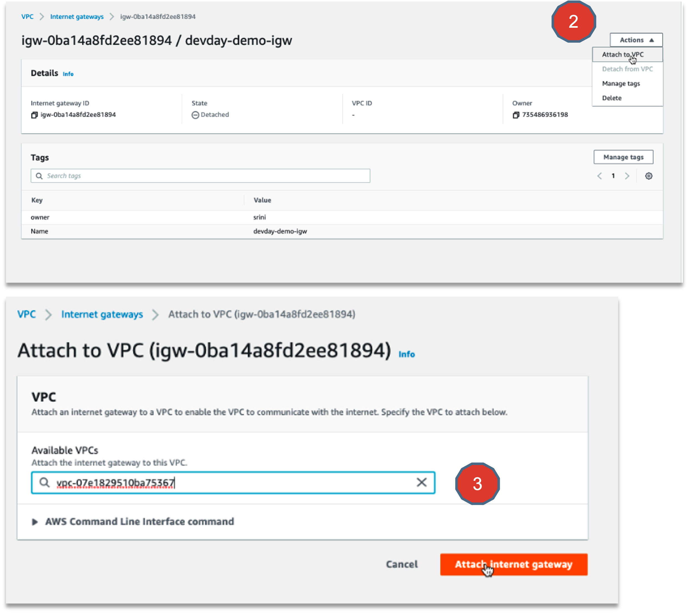

## Creating Route Tables
Create a Route table for the VPC (Point#1)
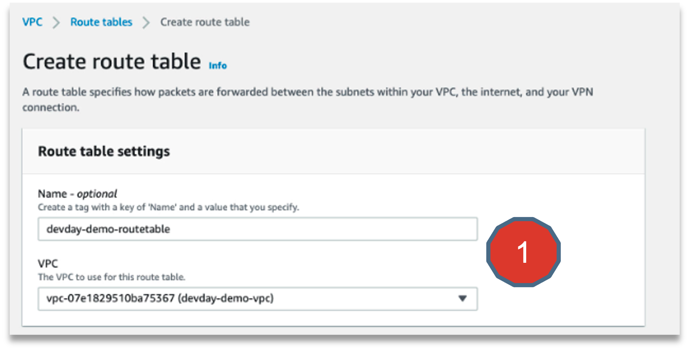

Edit Routes for this Rout table ( Point#2)
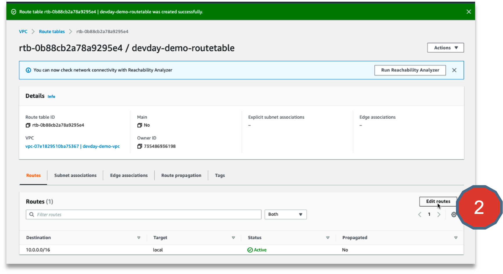
Add a route from anywhere in the world ( 0.0.0.0/0)  through this Internet Gateway (Point#3).
Save Changes (Point#4)
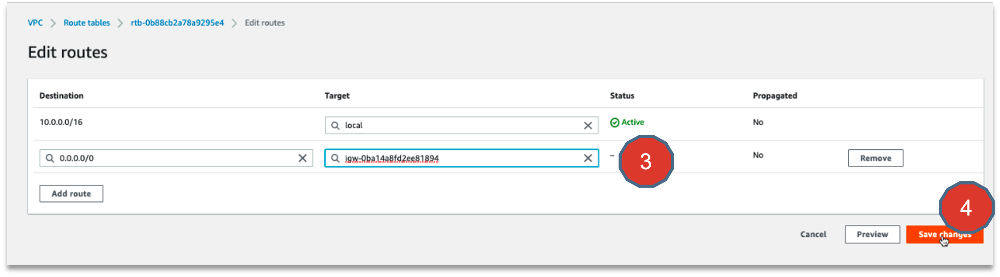

## Subnet association confirgurations

1. Click on Subnet associations
2. Notice subnets mentioned under “Subnets without explicit associations” section.
3. Click Edit subnet associations
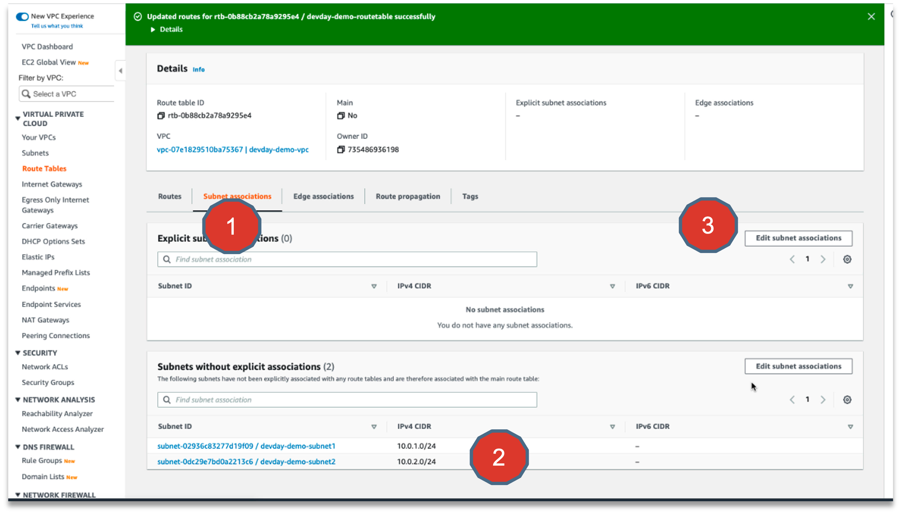

4. Add these subnets to associate with the Route Table
5. Click “Save Associations”
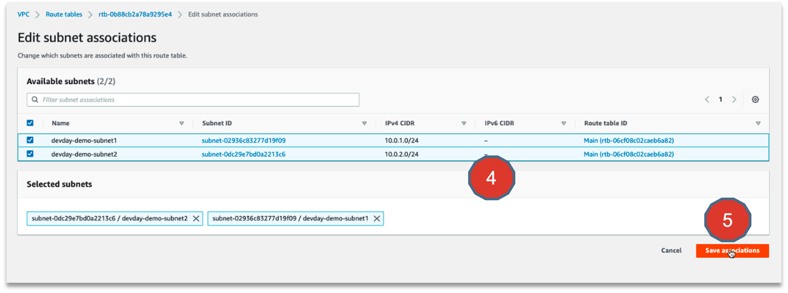

## Review configurations
Here is the end result of associating the subnets with the Route Table.
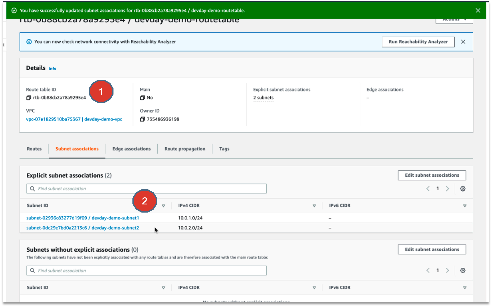


## Summary
So, you have reviewed the Data migration architecture and you have setup the VPC configurations needed for the rest of the exercises in this guide.

Congratulations, you have finished your first exercise.  Great going…

