# Lab 2 - Prepare Source System - MySQL

## Objectives
In this exercise, you will
* Create an EC2 instance to run a MySQL database on it.
* Install docker.
* Run MySQL database as a docker container.
* Load TPCDS data into MySQL database.

## MySQL database setup
1. Go ahead and launch an EC2 instance running  Centos Linux 7.
An example one here with AMI : `ami-0bc06212a56393ee1`

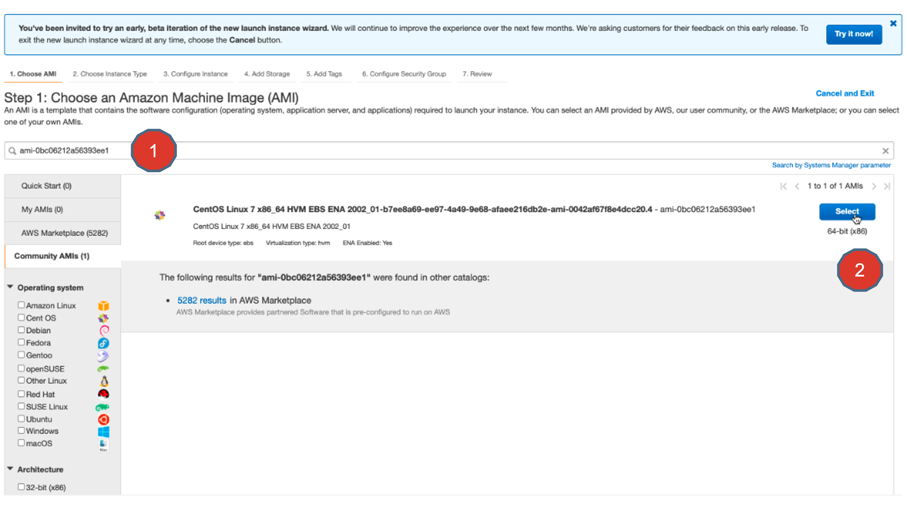

2. Choose Network as the VPC created in the previous exercise (Name:  devday-demo-vpc). Choose subnet as “devday-demo-subnet1”.  Also “Enable” Auto-assign Public IP.
DO NOT hit “Review and Launch” yet. Instead click “Next: Add storage”
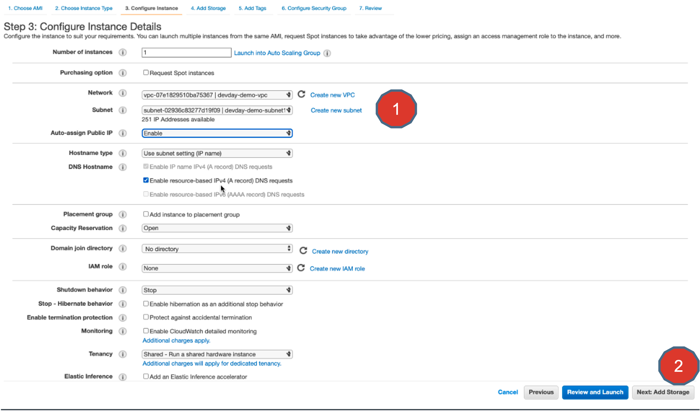

3. Set the storage to 40GB.Enable Delete on Termination check box.
DO NOT hit “Review and Launch” yet. Instead click “Next: Add Tags”
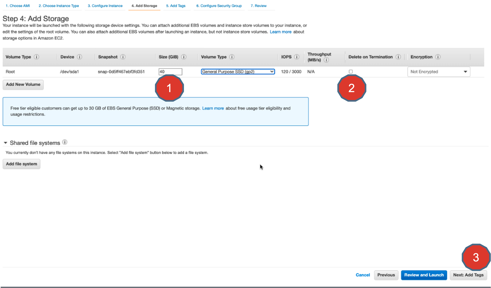

4. Add Tags in step 5 and hit “Next” . Then you will get to this screen.
Configure a Security group with SSH from your IP.
And to the port 3306 from any machine within the VPC (notice the CIDR: 10.0.0.0/16  Its same CIDR as your VPC.
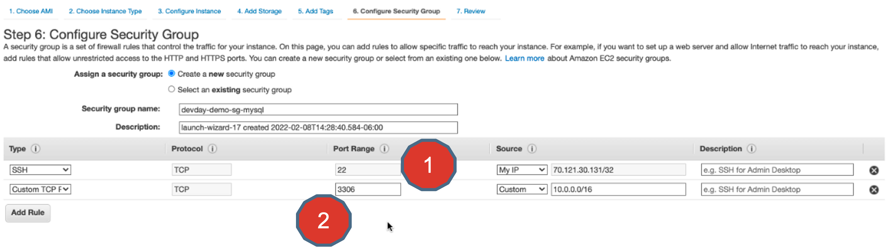

5. Finally, choose a secret key pair file. Create a new one or use an existing one. In this case I am using an existing key. This is to securely SSH in to the EC2 Machine.
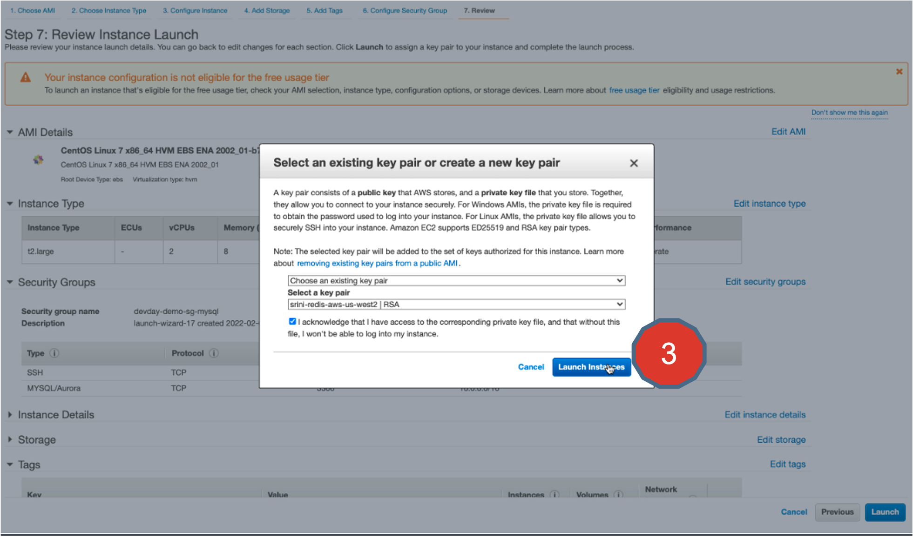

6. Once the instance is launched, you can access it by clicking on View Instances.
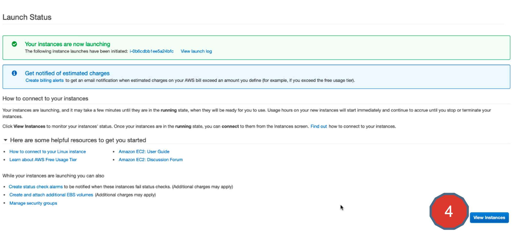

7. Here you can observe that the instance has been successfully launched and has a –
* Public IP address
* Private IP address
* And the VPC and subnet appropriately associated with it.

In essence, this EC2 instance is running in the intended VPC you created in the previous exercise.

We will use this EC2 instance as VM that runs MySQL server in a docker container.  This MySQL database server will be used as a source database system.

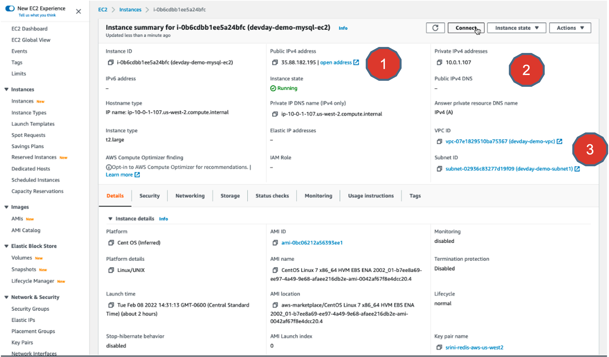

8. Let’s connect to this EC2 machine using SSH command.
Example:
```
ssh –i <path_to_private_key_file.pem> centos@<public ip address>
```

Once you are in , start running the following commands to install docker, start docker service and to pull mysql docker image.

Here are the commands to run:

```
sudo yum install docker -y
sudo service docker start
sudo chmod 666 /var/run/docker.sock
docker images
sudo docker pull mysql
docker images
```
Here is how the output may look like:
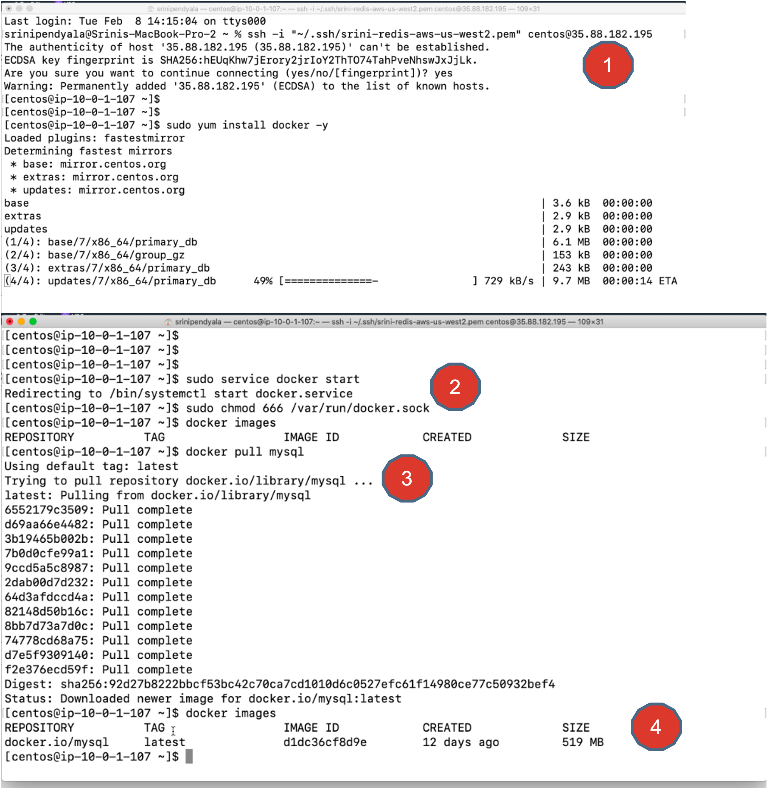

9. Now the docker image is downloaded on to the EC2 machine. It's time to run MySQL in the docker container using docker run command as shown.

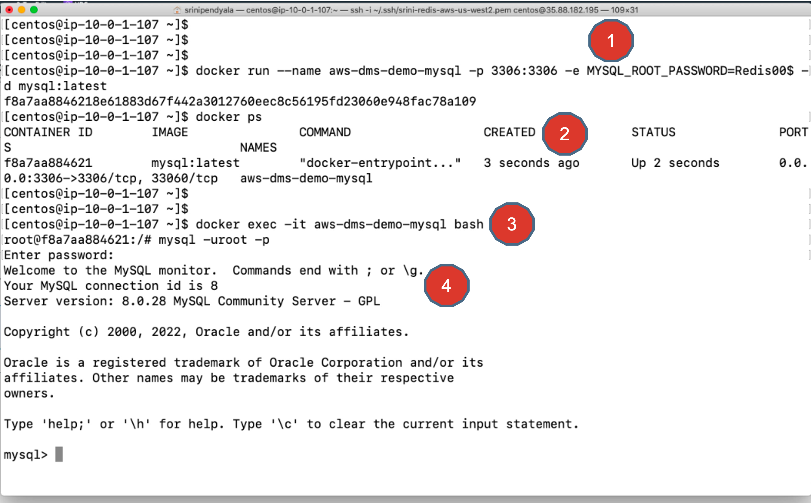

* Docker ps command ascertains that the container is running.
* Then using docker exec command open an interactive terminal into the container and run mysql command
* My SQL Root user password : Redis00$

Here are the commands for your reference:

```
docker run –name aws-dms-demo-mysql –p 3306:3306 –e MYSQL_ROOT_PASSWORD=Redis00$ -d mysql:latest
docker ps
docker exec –it aws-dms-dem—mysql bash
root@<docker_container_id>:/# mysql –uroot -p
```

10. Now at the mysql terminal, you can
* Show databases that are existing in the database system.
* Create a new database called “tpcds”
* Again,  re-run the show database command to ensure ”tpcds” database is created.

It is in this “tpcds” database schema that you going to create all the tables and load data into.
Exit from this container by typing exit multiple times, until you get back to the centos user SSH session on the EC2 machine.

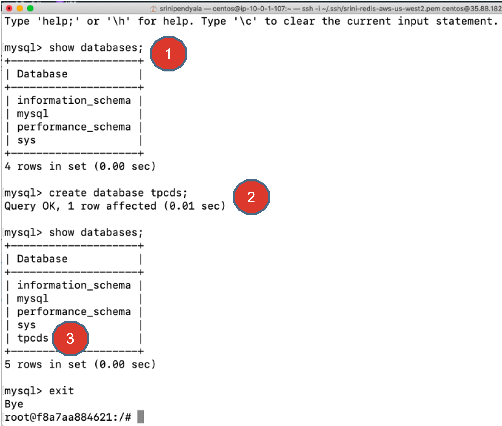

11. Now we are going to download the demo data to the EC2 instance so that we can load the data into MySQL database.
In order to do that, you need a few utilities to be installed.
Go ahead and install the utility, ”wget”,  then download a zip file using wget and finally install “unzip” utility.
Following are the commands:

```
sudo yum install wget -y
wget https://aws-devday-resources.s3.us-west-2.amazonaws.com/awsdevday-dms-demo-data.zip
sudo yum install unzip -y
```
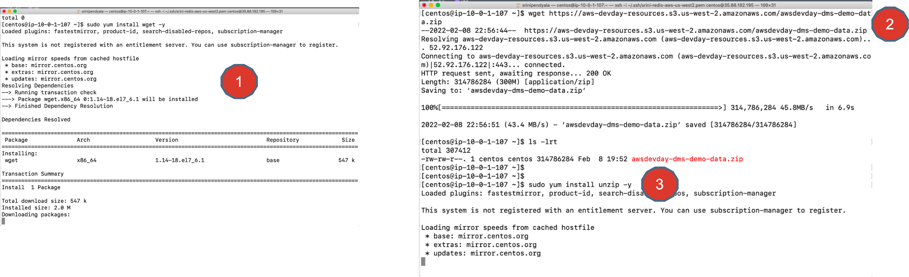

12. After downloading the `awsdevday-dms-demo-data.zip` file, unzip the contents using “unzip” command.
That creates a “tmp” directory.
Change directory using “cd tmp” command and list the contents using the “ls—lrt” command.

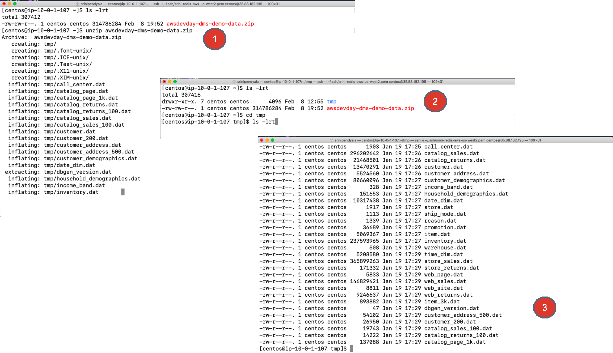

13. Now get the Container ID for the MySQL container.
```
docker ps
```
Copy the tmp folder extracted in the previous step into the root folder of the MySQL docker container
```
docker cp tmp <container_id>:/
```
Open up an interactive bash terminal to the container.
```
docker exec –it <container_id> bash
```

Within the container, change directory to tmp folder.
```
cd tmp
```

And list the contents of tmp directory to ensure that all the files got copied over from the host EC2 machine into this MySQL container.
```
ls -lrt
```

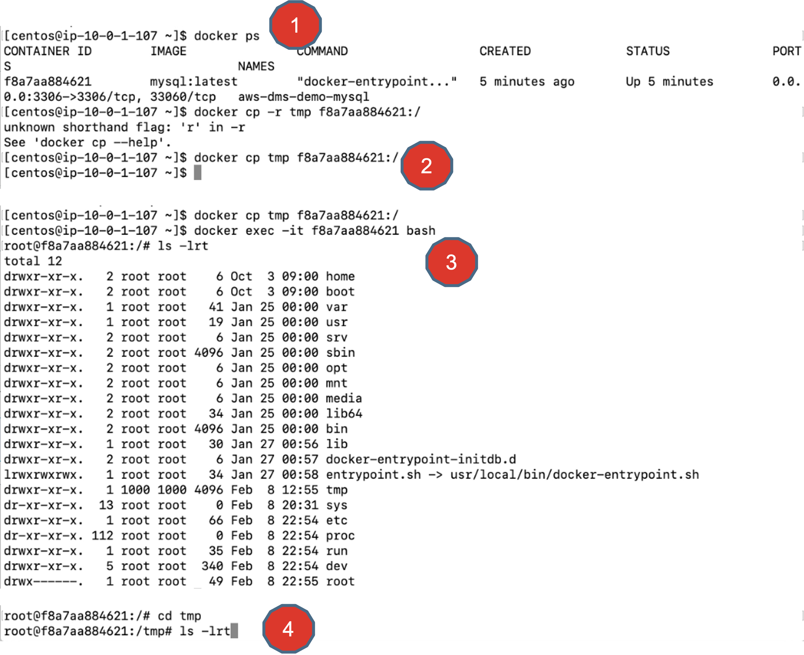

14. Now run the mysql command to load the database schema that has all the relevant tables in to `tpcds` database.  Notice, you are doing this within the container and from the `/tmp` folder. Enter the password for all of these MySQL commands as “Redis00$”

```
root@<container_id>:/tmp#  mysql –uroot –p tpcds < tpcds.sql
```
Now login into MySQL to check if the tables were created successfully or not.
```
root@<container_id>:/tmp# mysql –uroot -p
```
And run the following commands at the mysql prompt, to ensure all tables were created.
```
mysql> show databases;
mysql> use tpcds;
mysql> show tables;
```

And that should enlist all of the database table created in the `tpcds` schema. Remember we loaded all of these tables from the `tpcds.sql` file.

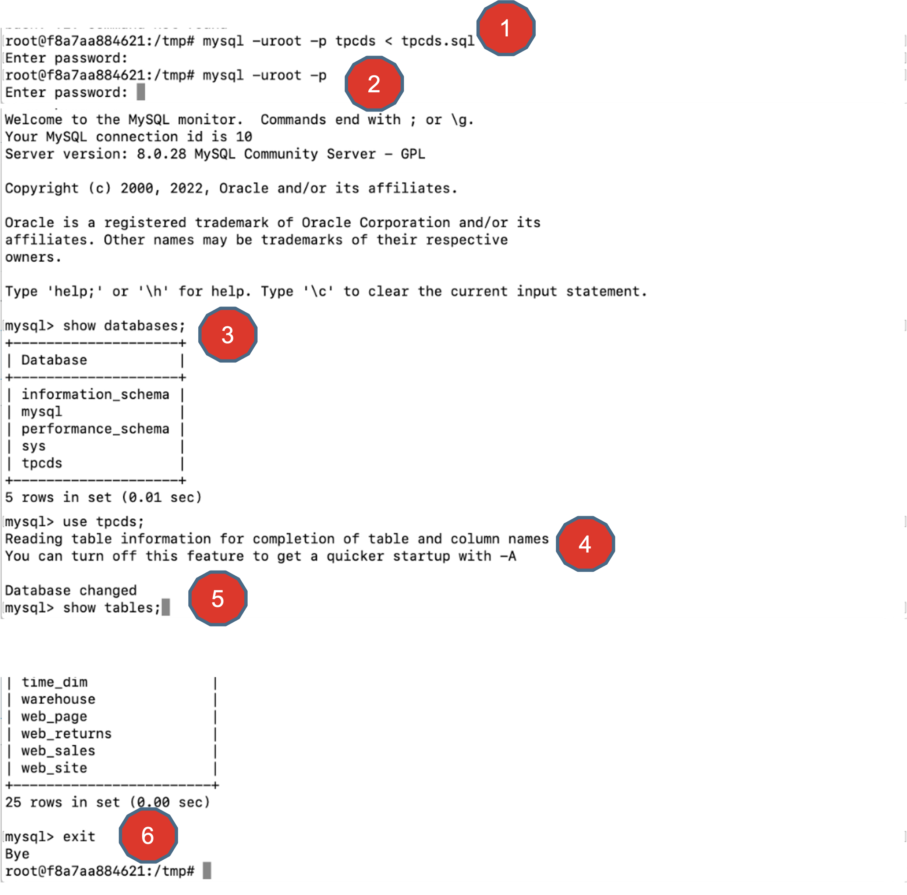

15. Its time to start loading the data.
You are doing this from the tmp folder within the MySQL container.
So, make sure you opened interactive terminal using the following command.
```
 docker exec –it <container_id> bash
```
Then change to “tmp” folder within the container.
```
cd tmp
```
Set a MySQL global variable to not run into any errors while loading data.
```
mysql –uroot –p –e “SET GLOBAL local_infile=1;”
```
Now start loading the data. MySQL command to load data :
```
mysql -uroot -p --local-infile -Dtpcds -e "load data local infile <table_name_file>.dat' replace into table <table_name> character set latin1 fields terminated by '|'"
```

Example:
```
mysql -uroot -p --local-infile -Dtpcds -e "load data local infile 'catalog_page_1k.dat' replace into table catalog_page character set latin1 fields terminated by '|'"
```

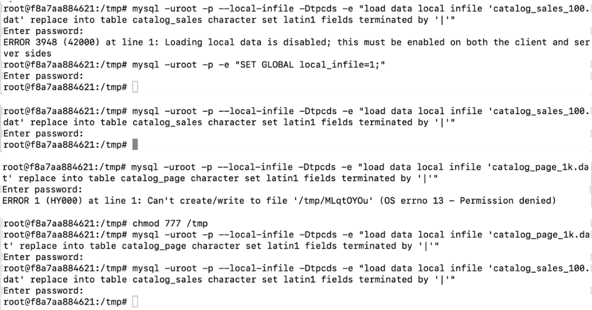

16. Now you can start loading all of the data from the data files within the tmp folder.

> Important:  This can take couple of hours doing this. So, you do not need to load all of the data, unless you want to run a huge dataset migration.
From the learning standpoint of these exercises, you can just load only two tables:
store_sales
web_sales

Here are the commands to just load these two tables.

```
mysql -uroot -p --local-infile -Dtpcds -e "load data local infile 'store_sales.dat' replace into table store_sales character set latin1 fields terminated by '|’”

mysql -uroot -p --local-infile -Dtpcds -e "load data local infile 'web_sales.dat' replace into table web_sales character set latin1 fields terminated by '|'"

```

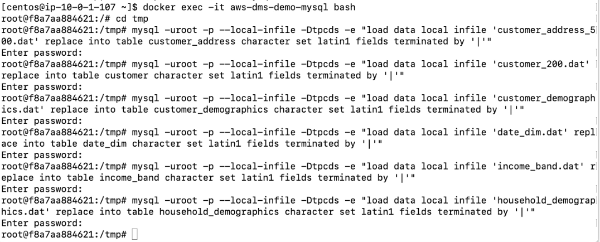

17. Once you load the data successfully, you can run the select count(*) my sql commands to ensure that the total count of records match these numbers.

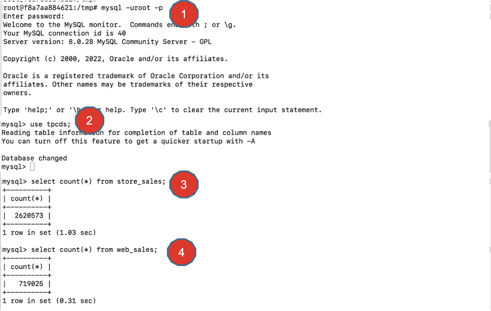


## Summary
Congratulations, now you have successfully setup your MySQL database and loaded data into.
Keep up the great work you are doing.

In this exercise, you have successfully accomplished
* Creating an EC2 instance to run a MySQL database on it.
* Installed docker and ran MySQL database as a docker container.
* And finally you have loaded TPCDS data into MySQL database.


