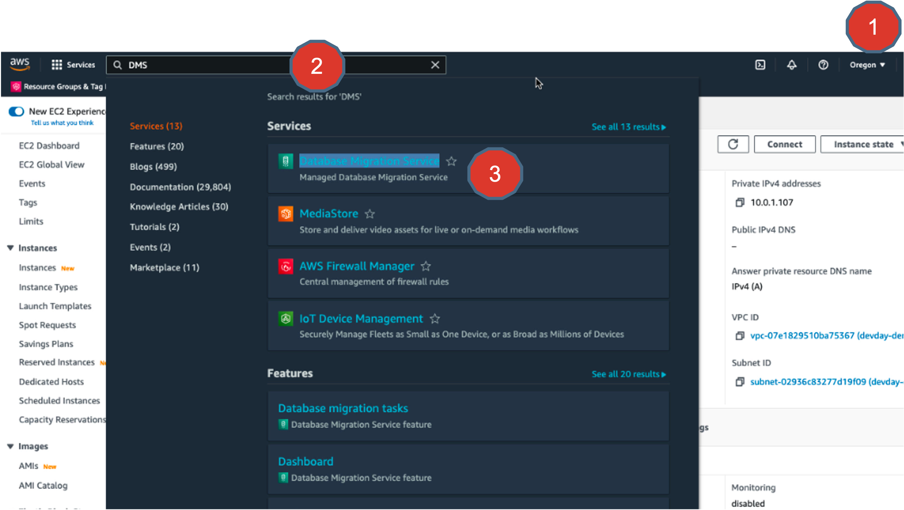
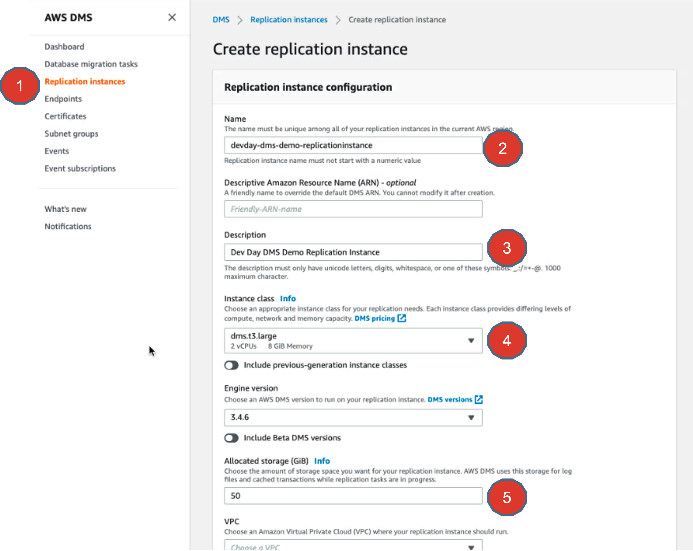
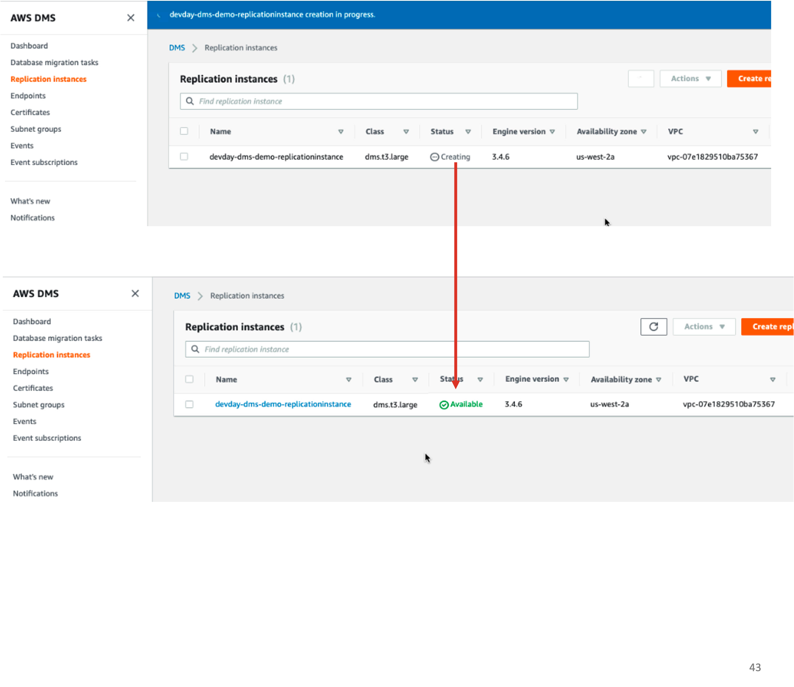
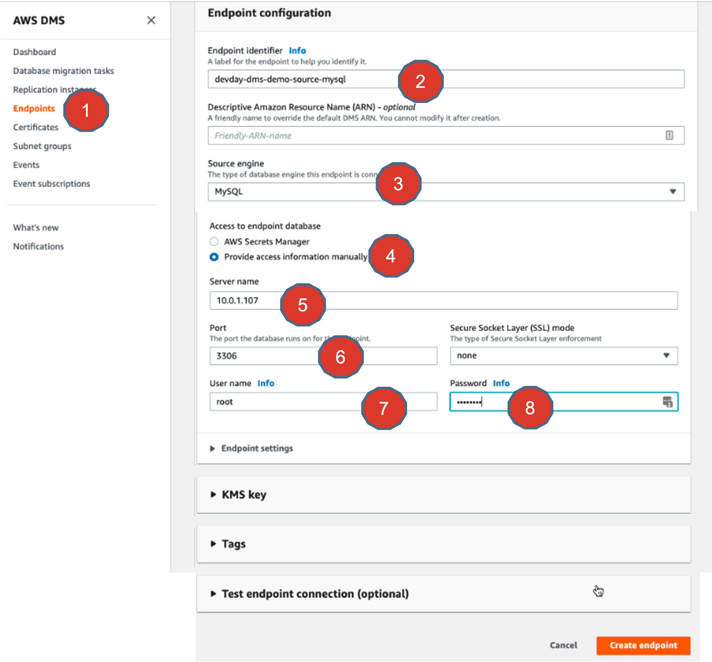
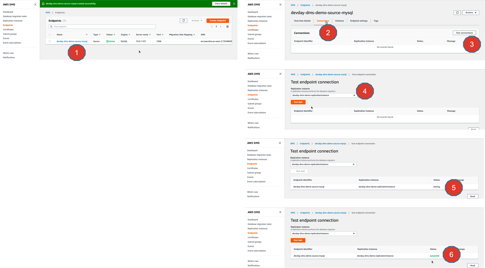

# Lab 3 - AWS DMS - Endpoint Configuration for your source - MySQL

## Objectives

In this exercise, you will
* Create an AWS DMS Replication instance
* Create an AWS DMS endpoint that points to MySQL database server
* Test endpoint Connection

## Creating AWS DMS Replication instance
1. Its time to login into your AWS Web Console.
Make sure you choose the right region of your choice. In this case, I chose us-west-2 (Oregon)

Go ahead and search for DMS service and select it.

2. In the AWS DMS Dashboard, select Replication Instance and go ahead and create a Replication instance.

Choose a Name, Description, Instance Class and storage, as shown.

3. VPC Configurations:
* You are going to launch this Replication instance in the same VPC as your source database system : MySQL is running.  So, choose the VPC you created in the previous exercises.
* Choose MultiAZ to a single AZ option as this is only for a learning exercise.
* You can uncheck the ”Publicly accessible” flag to NO, so that this Replication instance is only accessible via private network.
* Choose the Replication subnet to a default one suggested.
* Select AZ as us-west-2a
* Leave “default” for VPC Security Group

4. Launching Replication instances:
* Go ahead and launch the DMS Replication instance.
* It gets created and finally attains “Available” status which indicates that the Replication instance is successfully launched.

4. Endpoint configurations:
* Now its time to create an endpoint that points to your MySQL source database.
* Give it a name.
* Choose Source Engine = MySQL
* And provide access to the database manually.
* Servername ==> This is the private IP address of the instance where your MySQL server is running.  Remember the EC2 instance you launched in previous exercise that was running MySQL server in a docker container?  That is the IP address that goes here.
* Port is 3306
* User: Root
* Password: Redis00$

5. Testing connectivity:
* Its time to test your connectivity between your Replication Instance and your MySQL Database instance.
* Click on your MySQL Source endpoint
* Click on Connections tab
* Click on Test Connection
* Choose the Replication Instance and hit “Run test” button
* Observe the “Testing” status.
* Once done the status becomes “Successful”

## Summary
Congratulations. You just finished creating an AWS DMS endpoint for your MySQL database and also tested the connectivity between a Replication instance and your MySQL database.

Great work. Take a quick break and start chasing the next exercise..

