# Lab 4 - Prepare Target System - Redis Enterprise Cloud

## Objectives
In this exercise, you will
* Create an account with Redis.
* Create a new Redis Enterprise Cloud subscription in AWS.
* Provision a database.
* Establish VPC Peering between Redis VPC and your AWS DMS VPC.

## Hands-on exercise steps

1. Sign Up for an account at app.redislabs.com :
Please visit: app.redislabs.com in your browser
Please go ahead and sign up. User your work email, if you want to submit your  hands-on exercise for receiving a gift card.
You will receive an email Welcoming you to sign in. Check your email and sign in.

And then click on the Activate Account button in your email.
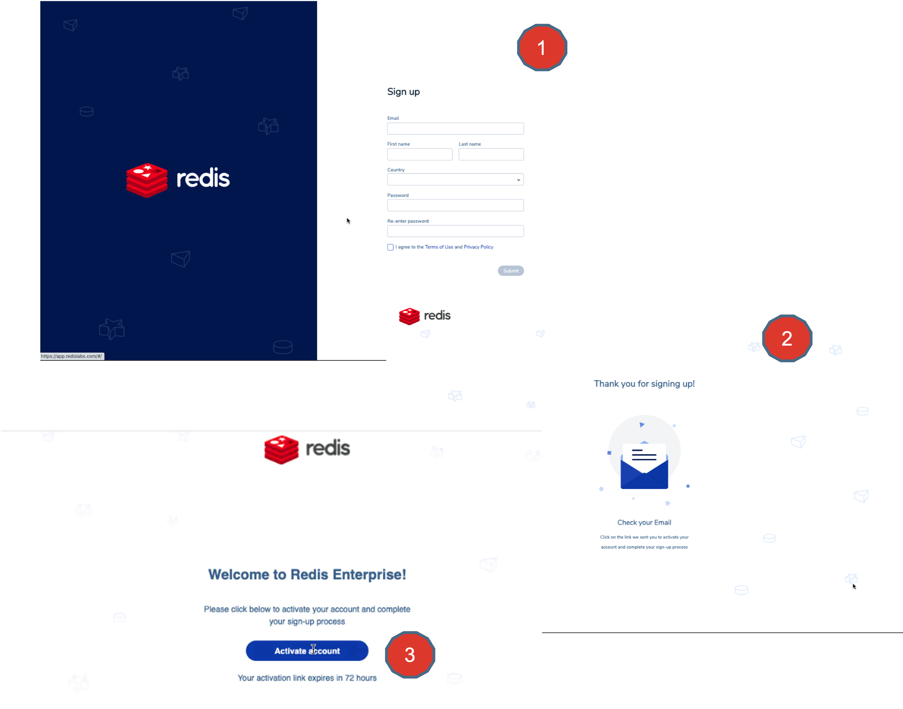

2. This is the first screen you would see, once you sign in.
Familiarize yourself by clicking on the Left Hand Side Navigation bar and navigating through all of the options like Databases, Data access control etc.

Go ahead and click on the “ New Subscription” to start creating one.
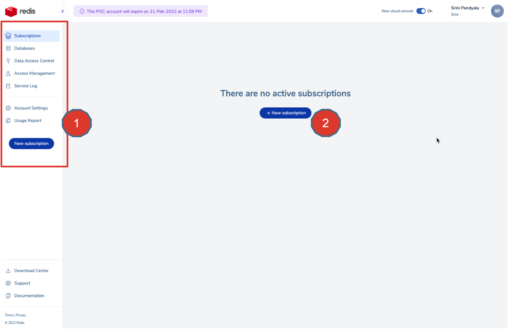

3. Go ahead and create a subscription.For this exercise we will choose a Flexible Plan.

Choose AWS as the cloud provider and Region as us-west-2 and give this subscription a name. In this case, “devday-aws-subscription”.
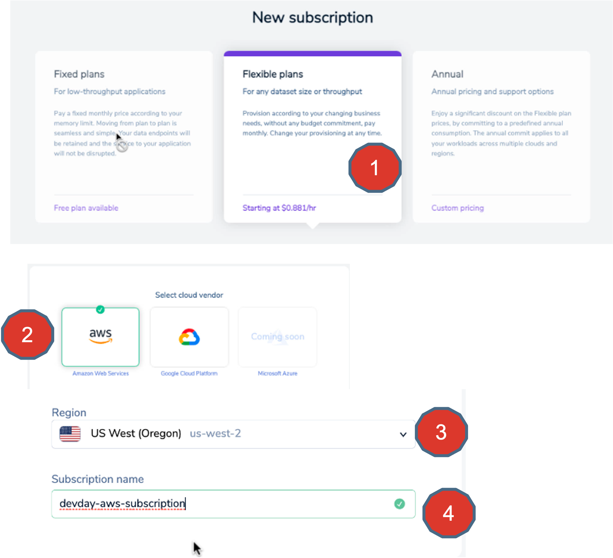

4. Choose  Multi-AZ on. And give VPC CIDR as “ 192.168.1.0”
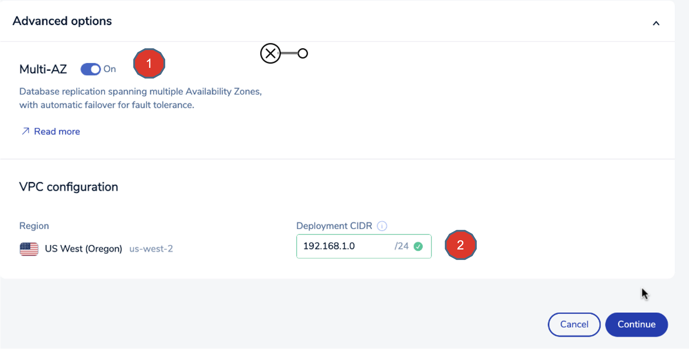

5. Its time to start designing your tables. Click on `+` to add databases.
Define Throughput, Memory, High Availability, OSS cluster API, Protocol exactly as shown.
To keep costs down, just choose 0.5 GB as shown in the picture.
Finally click save database.
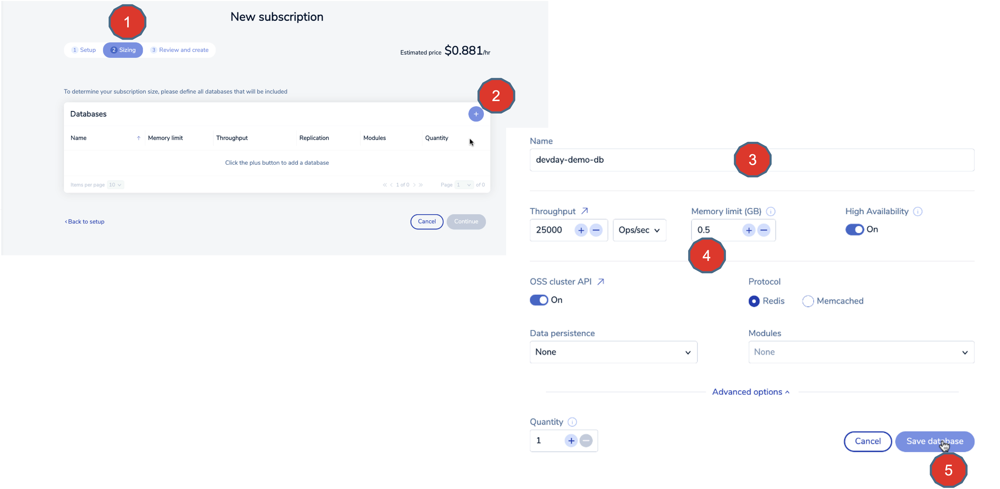

6. Click “Continue” and you will see an estimate of subscription price for running this cluster.  Click create subscription to create one, after reviewing the costs.

> Important Information : Running this Redis Cluster will cost your around $0.88 per hour. These exercises can take up to 4 hours to complete. Hence, please kindly be informed that you may incur $4.00 (USD)  or more , for doing these exercise, from Redis Inc.
Also, please note  you may also additionally incur AWS cloud resource costs. Hence, its important to do the last exercise in this guide to clean up all resources and to save costs.

7. While the cloud resources are being provisioned, the work in progress status is shown visually as annotated in this picture.
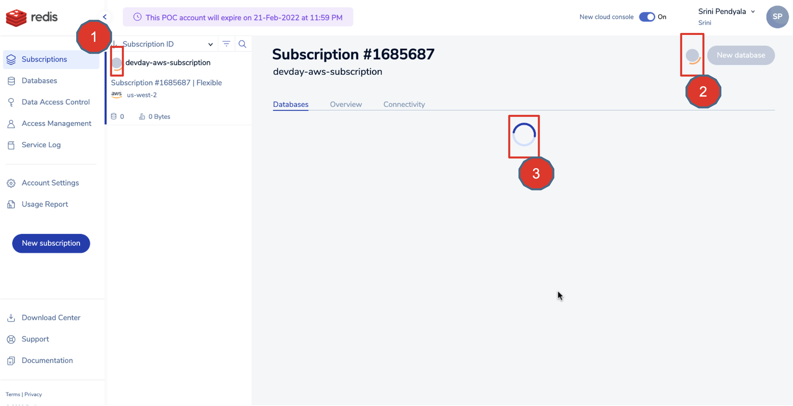

8. Once the subscription is ready, you will a Green Check Mark next to your subscription and the status would turn Green once your database is ready with endpoints to connect to.
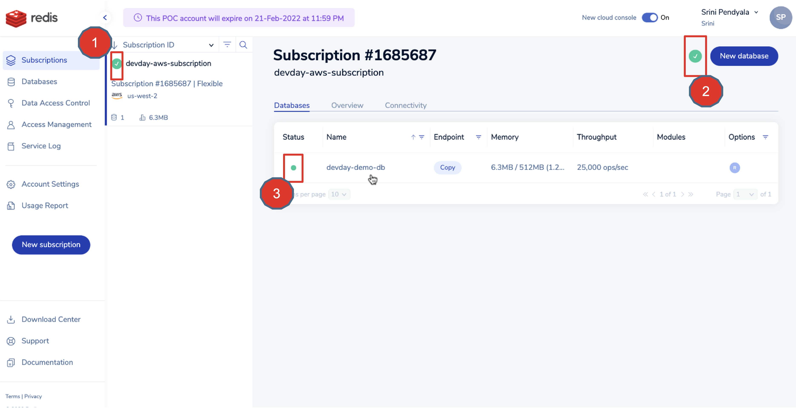

9. Now you have a Redis Enterprise Cloud Database running on  AWS. This is running a VPC that is provisioned for your by Redis.

However, your source database (MySQL Database server) and your AWS DMS Replication instance is running in a separate VPC (devday-demo-vpc) you created in the previous exercises.

In order for your devday-demo-vpc to communicate with Redis Database VPC, you need to establish a secured VPC Peering connection.

Simply follow the sequence shown in this picture.
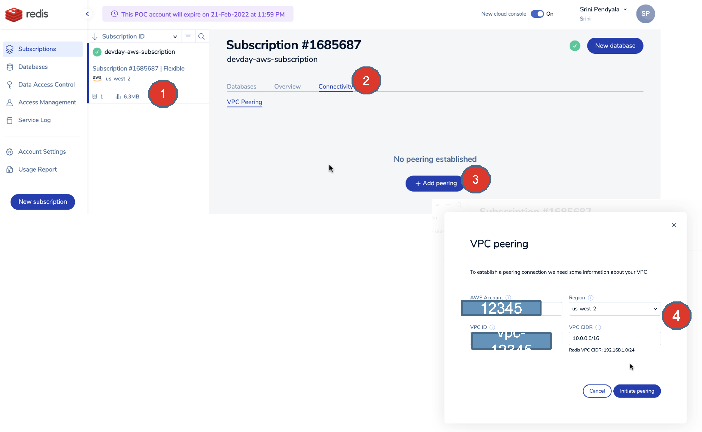

10. Choose the subscription, Click on the Connectivity tab.
Click on ”Add Peering” button.
On the VPC Peering screen, provide the following information

AWS Account :  This is the account in which you provisioned your MySQL Database server and your DMS replication instances.

VPC ID: This is your VPC id  in which you provisioned your MySQL Database server and your DMS replication instances.

Region: This is your region in which you provisioned your MySQL Database server and your DMS replication instances.

Finally give the VPC CIDR information.
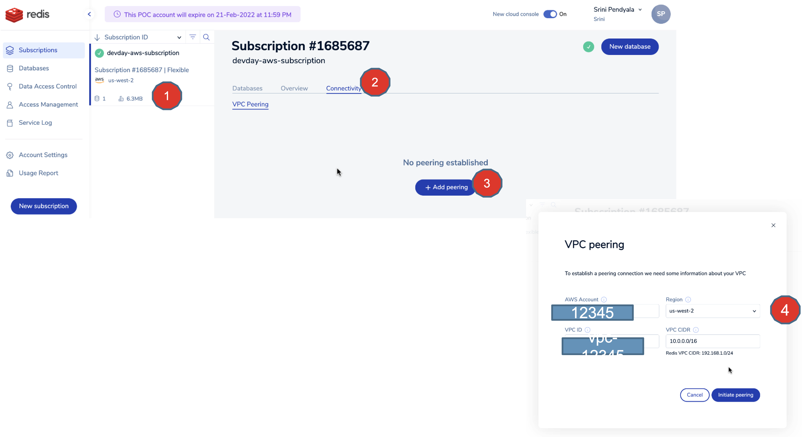

11. That gives you a Peering Connection ID. In this case its `pcx-0a8fd1f7f00cad67d`.

Copy this peering connection id. You will need this to search for it in AWS console and accept the peering connection request.
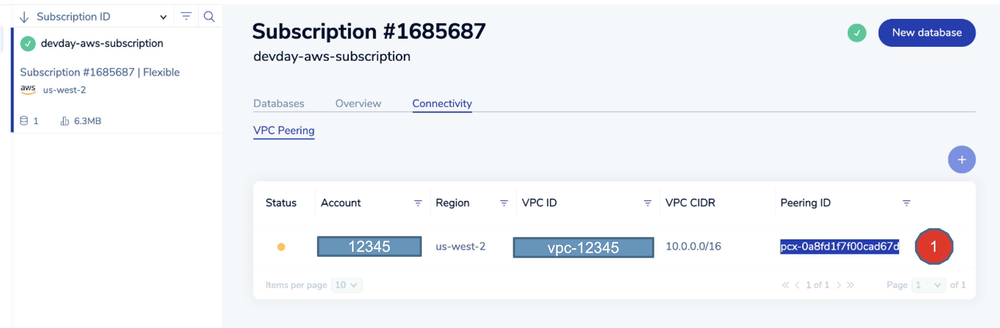

12. Go to AWS Console ==> VPC ==> Peering Connections.

Search for the Peering connection that was initiated from Redis. In our case, it is : `pcx-0a8fd1f7f00cad67d`

Once found, give it a name called – “devday-demo-pcx” , just to identify it easily.
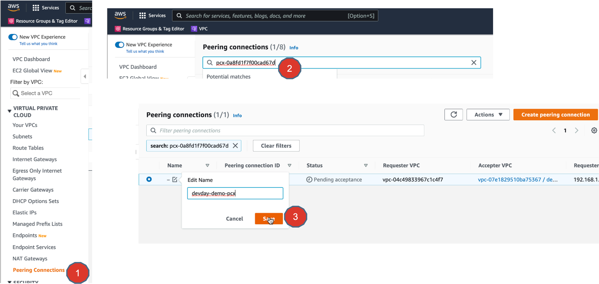

13. Simply accept the VPC Peering Connection request, by clicking on the Actions ==> Accept request.
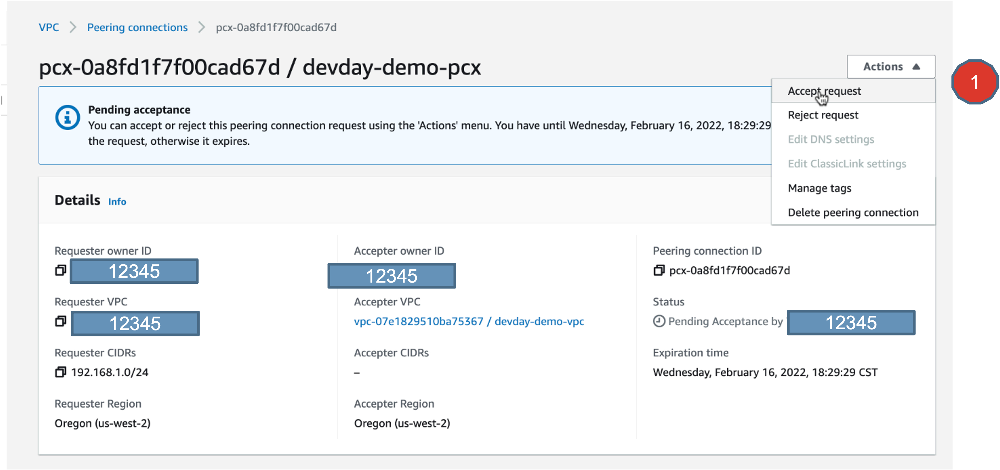

14. Simply accept the VPC Peering Connection request, by clicking on the ==> Accept request button.
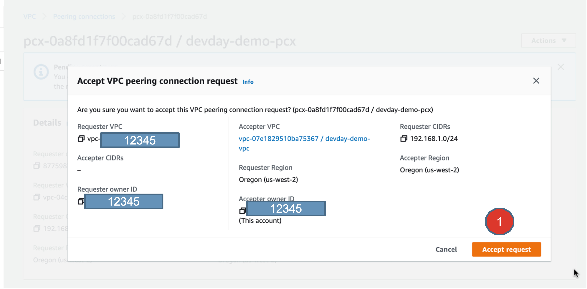

15. Finally, you will see that the VPC Peering connection is established.
Now copy the Requester CIDR info, to your clipboard. You need this to edit the Route tables.
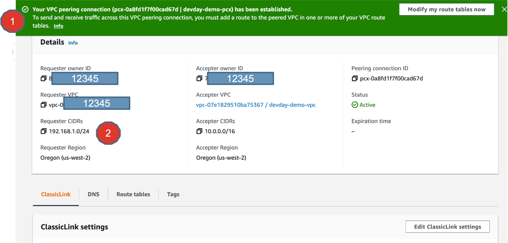

16. Go back to the ”devday-demo-routetable” you created in the first exercise, and edit the Routes.
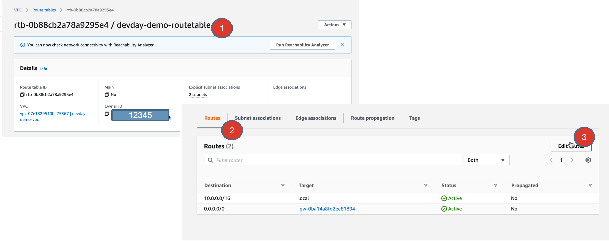

17. Define the route using the Requester CIDR from your accepted VPC Peering Connection, as shown.

In essence, what you are doing in this route table is that, any traffic that is targeted to Redis Enterprise Cloud VPC ( with CIDR 192.168.1.0/24), to use this Peering Connection and reach to the destination servers, in this case, our Redis Enterprise Cloud database server endpoint.

18. Here is a snapshot of your Route tables, before and after we made this change.

## Summary
There you go, you now have provisioned a Redis Enterprise Cloud Database on AWS and established a VPC peering connection between your AWS DMS VPC and your Redis VPC.

