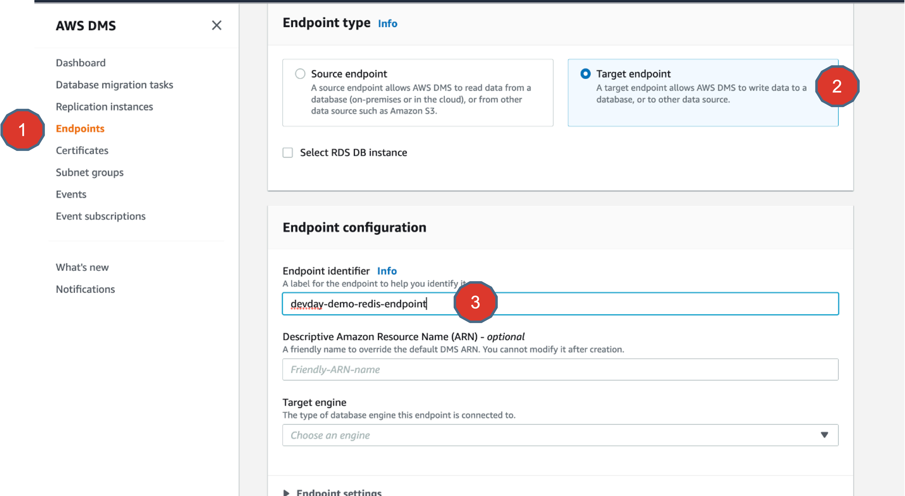
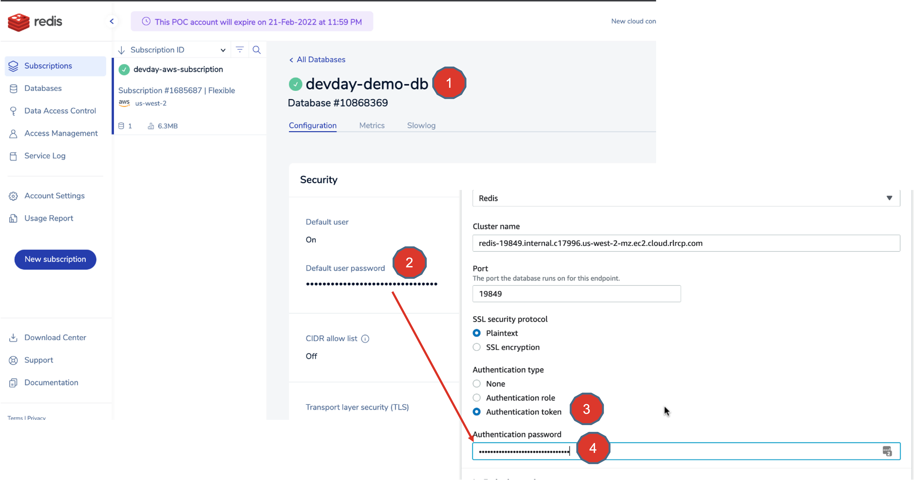
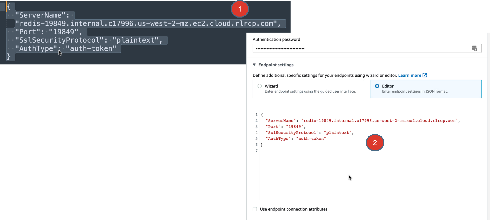
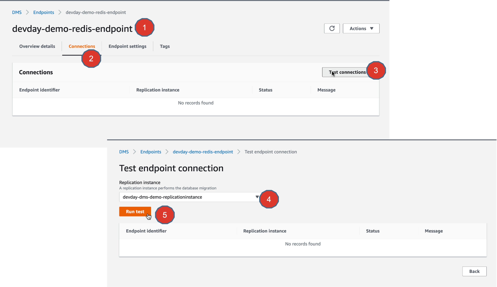
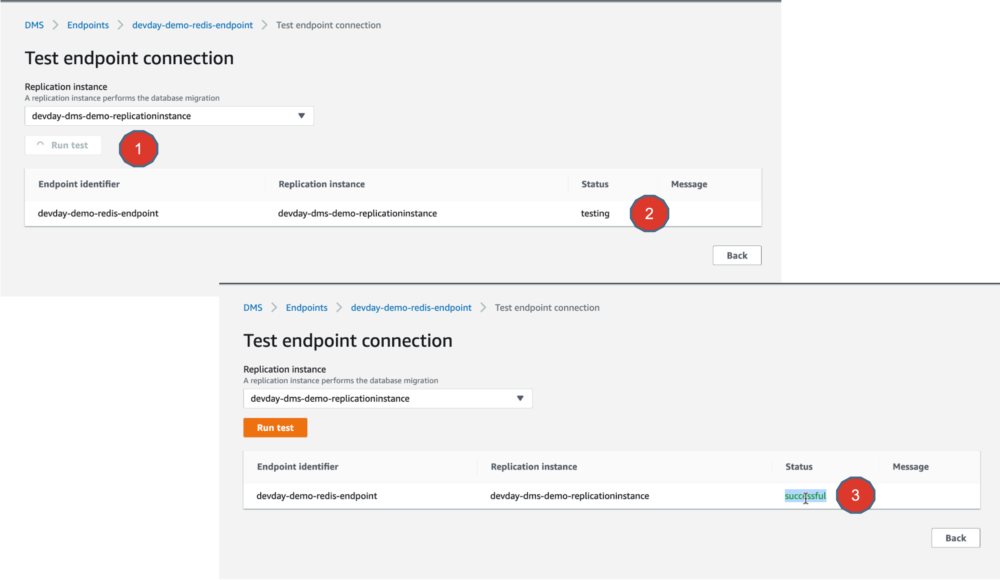

# Lab 5 - AWS DMS - Target Endpoint configuration for Redis Enterprise Cloud

## Objectives

In this exercise, you will
* Create an AWS DMS endpoint that points to Redis Enterprise Cloud database
* Test endpoint Connection

## Hands-on lab exercise steps

1. Now its time to go ahead and create the DMS Endpoint that points to Redis Enterprise Cloud on AWS, which is going to the target database system that we want to migrate data into.

Simply follow the visual annotations above.

2. From the Redis Enterprise Cloud subscription ==> Datbase ==> Configuration ==> Private endpoint, copy the private endpoint hostname:port details on to the AWS DMS Endpoint for Redis.

3. Choose the Authentication type as “Authentication token” and enter the password for default user from the Redis Enterprise Cloud ==> Subscription ==> Database ==> Configuration ==> Default user password.

4. Prepare a JSON string in the above format, with the details of the Redis Enterprise Cloud private endpoints and re-enter this JSON string in the “Endpoint settings” ==> Editor text box.

5. Go ahead and test the connectivity between your Replication instance and your Redis Endpoint, just like the way you did for your MySQL endpoint.

6. Once the test is run and connectivity is established between the Replication instance and your Redis Enterprise Cloud endpoint, the status would change from Testing ==> Successful.

## Summary
There you go, you now have established successfully connectivity between your Replication instance and your Redis Enterprise Cloud database endpoint.

