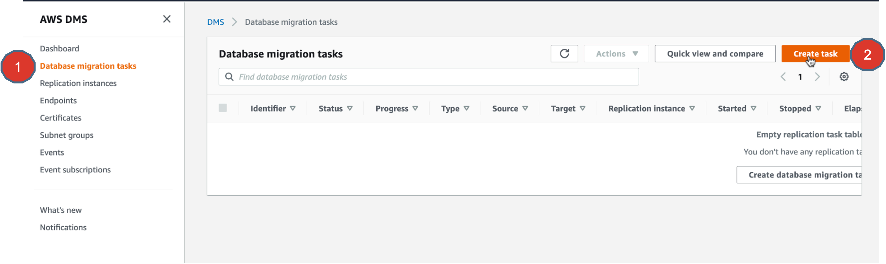
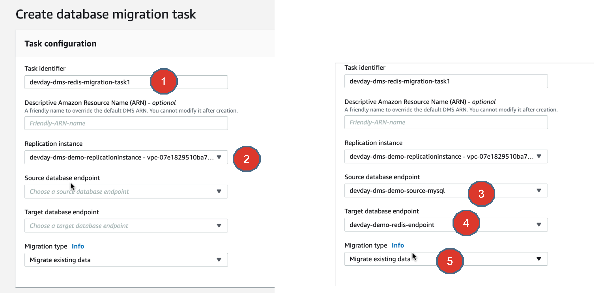
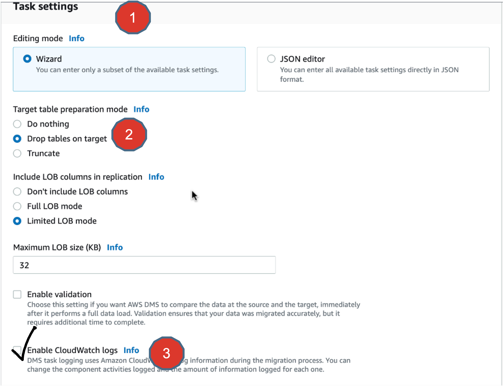
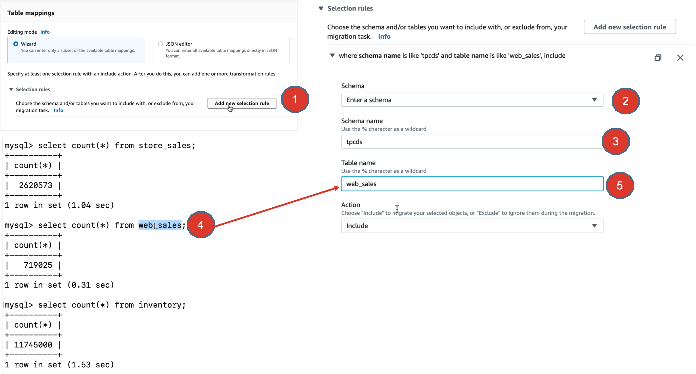
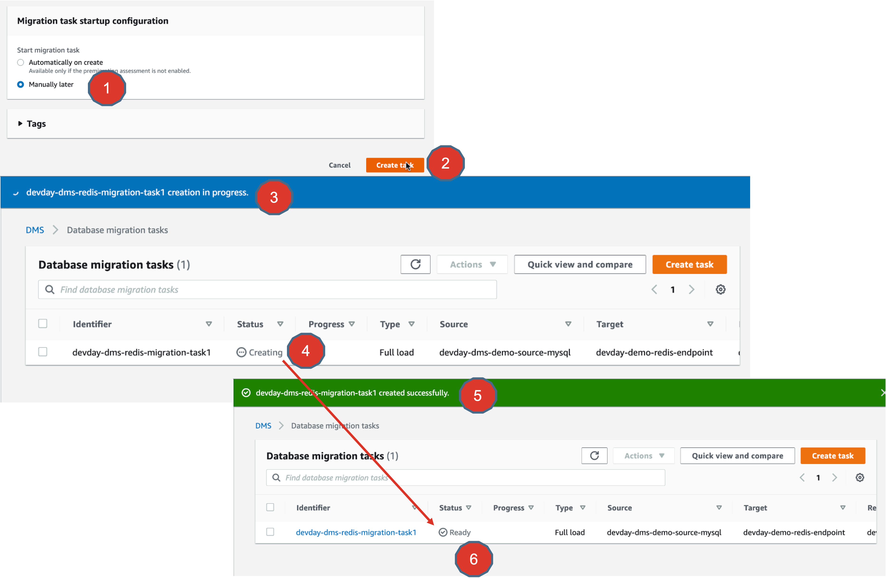

# Lab 6 - AWS DMS - Creating Migration Task

## Objectives
In this exercise, you will
* Create an AWS DMS migration task.
* Enable Cloudwatch logs for your migration tasks.
* Configure Table Mapping Rules for selective data migration.

## Hands-on lab exercise steps

1. Now its time to define your migration task to actually do a database migration.
Just do it.

2. Start creating a database migration task.
Give it a name, choose the Replication instance.
Select a source database endpoint => which is our ==> MySQL database endpoint.
Select a target database endpoint => which is our ==> Redis Enterprise Cloud database endpoint.

3. Go ahead and start defining your task settings.
Choose “Drop tables on targe” for Target table preparation mode.  This is to ensure that when we run a data migration task, it always flushes the target database and loads the data afresh.
Also enable CloudWatch logs by checking the checkbox.

4. You can migrate the entire source database or only selective data.
To do this, you use Table mappings settings.
Go ahead and add a new selection rule. (Point#1)
Choose “Enter a schema” (Point#2)
Select schema name as “tpcds” (Point#3)
From our source MySQL database, let us choose the web_sales table. (Point#4)
And define it in the AWS DMS Data Migration task setting as shown (Point#5)

5. Finally choose migration task startup configuration as “Manually later”.
And hit the “Create task” button to create the migration task.
This will change the status of the task from “Creating” to “Ready”.

## Summary
There you go, you have finally defined the Migration Task too.
Now you should be ready to see things in action.
Great going so far.

