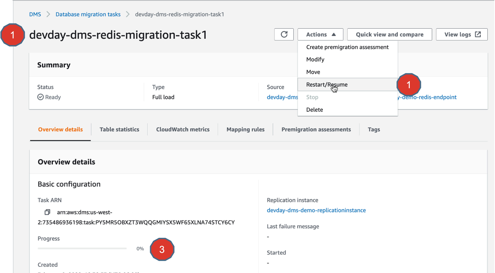
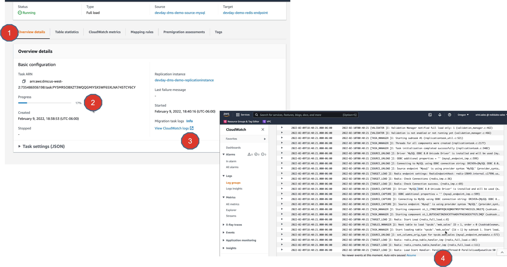
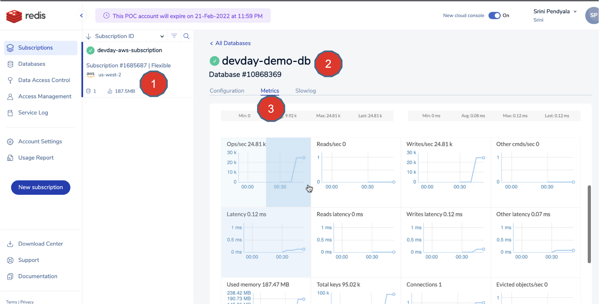
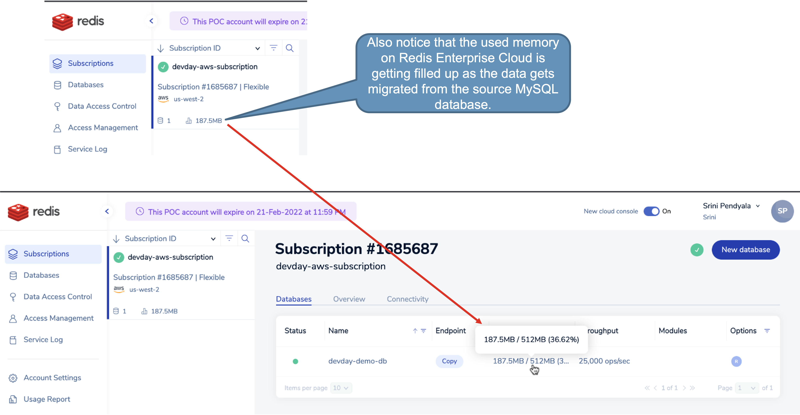
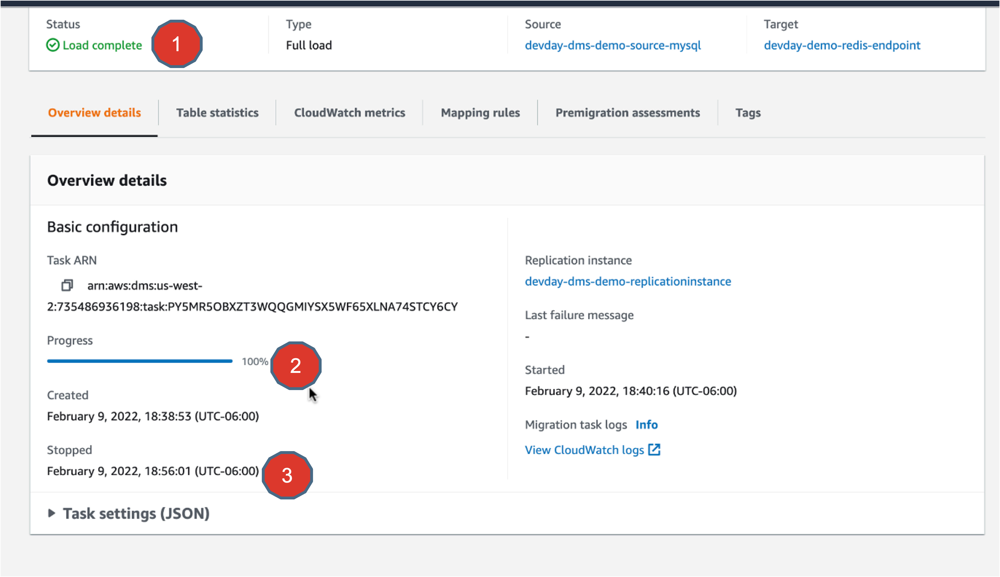

# Lab 7 - AWS DMS - Running Migration task

## Objectives
In this exercise, you will
* Running a migration task.
* Monitoring CloudWatch logs during migration.
* Monitoring migration progress

1. All that it takes now to run a job is simply to click “Restart/Resume” button.
And the progress can be seen here (Point#3)

2. While the task is running, you can monitor the progress. You can also go ahead and click on “View Cloudwatch logs”, which opens another browser window with the Cloudwatch logs being displayed.

3. On the Redis Enterprise Cloud side, you can go to the Subscription ==> Database ==> Metrics tab and can see the metrics that indicate that the data is being loaded as a part of migration.

4. Also notice that the used memory on Redis Enterprise Cloud is getting filled up as the data gets migrated from the source MySQL database.

5. Once the migration task is completed, you would see that the progress status reflects 100%.

## Summary
There you go, you completed running  your data migration from the source MySQL database to Redis Enterprise Cloud in AWS. Congratulations..

