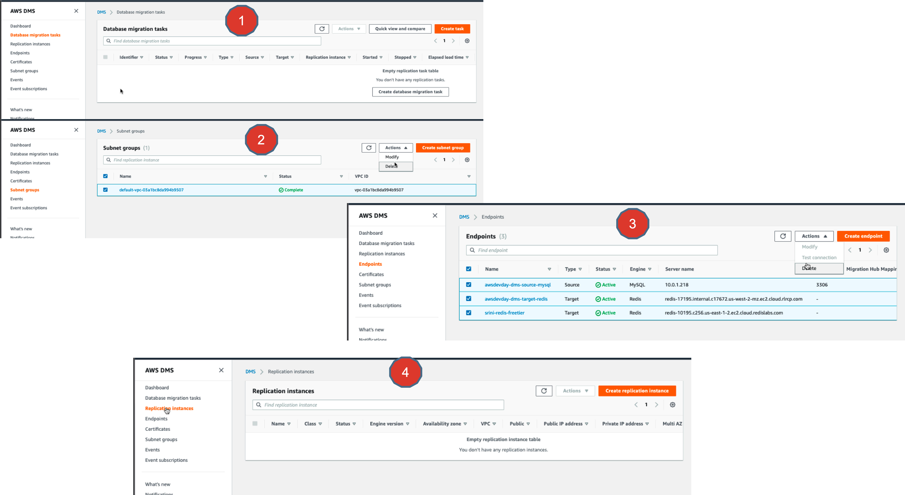
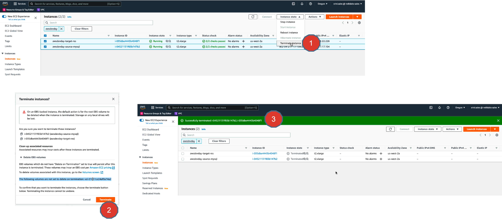
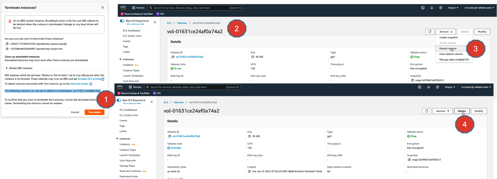
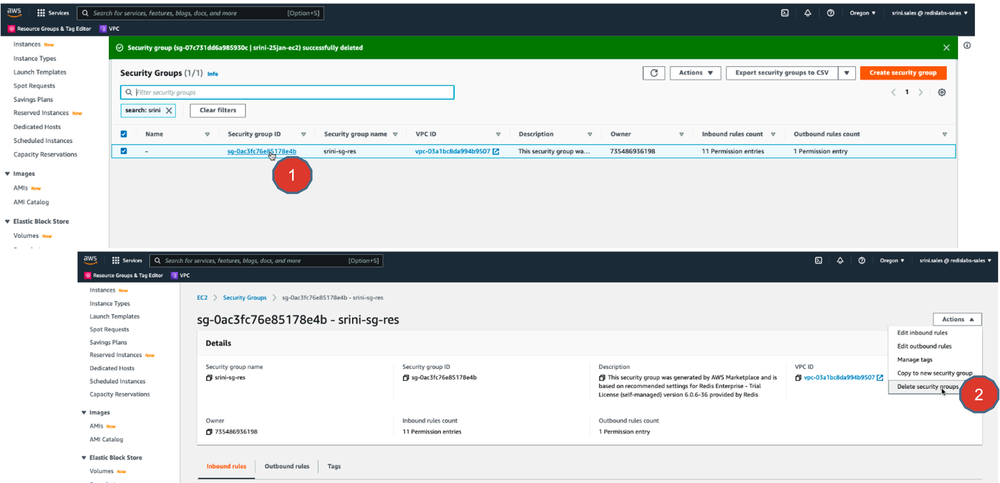
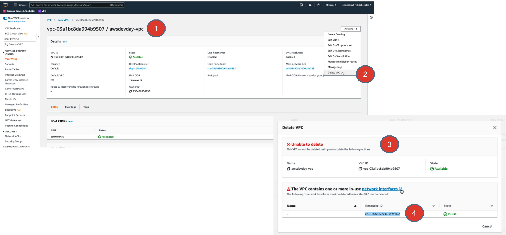
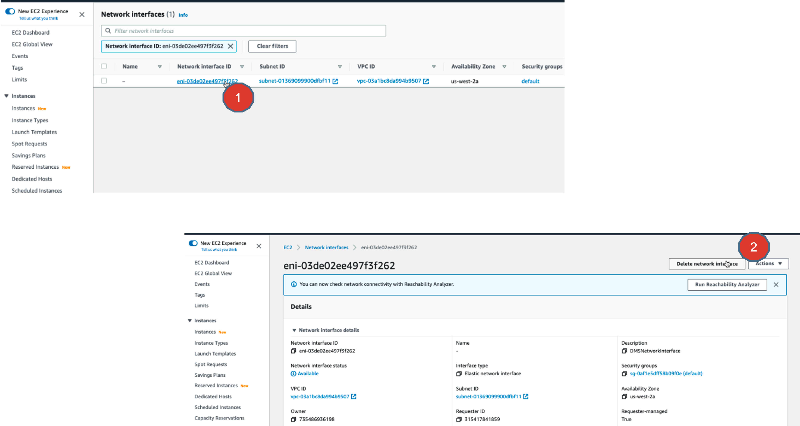
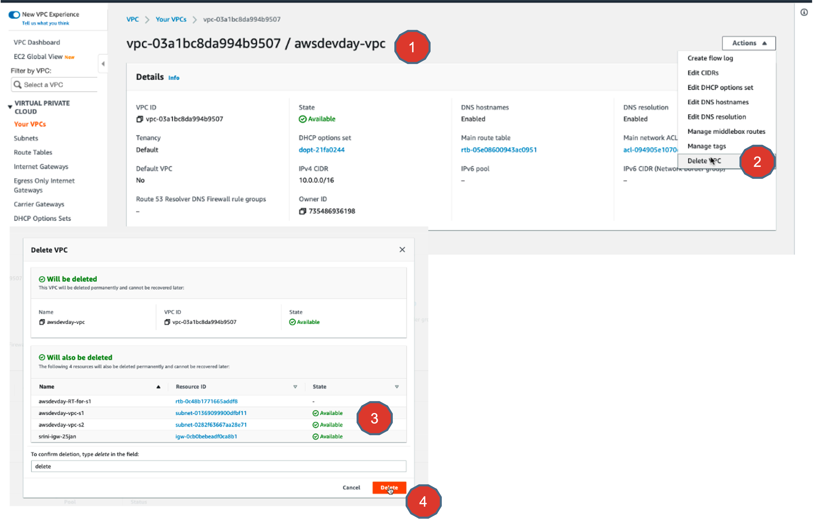

# Lab 9 - Cleaning up Cloud Resources

## Objectives
In this exercise, you will
* Clean up the cloud resources to save money and resources, after you are done with all of the previous exercises.

## Hands-on lab exercise steps

1. Go ahead and delete your DMS resources first.
* Data Migration tasks
* Replication Instance
* Subnet Groups
* Endpoints

2. Go ahead and terminate your EC2 instances.
You may have created at least one EC2 instance in these exercises to spin a Docker container running MySQL database and for running redis-cli client.
So go ahead and delete these instances.

3. While deleting a EC2 instance, sometime you may have an storage volumes that might need to be detached and deleted separately. If so, note the volume ID , search for it and detach it and finally delete it.

4. Also go ahead and delete any security groups you may have created in these exercises.

5. Now go ahead and delete the VPC itself. Sometime, if you have not deleted any dependency EC2 instances or DMS Replication instances, the network interface attached to those instances is not deleted and hence it throws an “Unable to delete” error. In that case, copy the elastic network interface id starting with “eni-xxxxxx”, search for it and carefully observe the contents to see which instances are still using it.  Make sure you have complete terminated EC2 instances and DMS replication instances and then that should easily delete the network interface.

6. This is how you can search for the network interface and identify the depending resources

7. After deleting the Elastic Network interface, you can safely and easily delete the VPC.

Delete VPC user interface also warns that the depending cloud resources such as :
* Route tables
* VPC subnets
* Internet Gateway

will be deleted as well.

Go ahead and click on Delete button. That will delete all of your route tables, vpc subnets, internet gateway etc.

## Summary
That’s pretty much about it.

A Big Congratulations. You have finished all of the exercises in this guide.

